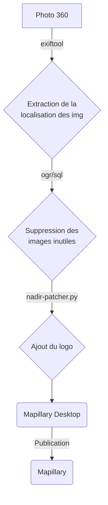

# gopromax2mapillary

Traitement des images de la GoPro Max avant publication sur Mapillary.



## Pré-requis

### Créer les répertoires suivant dans votre répertoire de travail :

- `in` : Dossier contenant les images issues de la GoPro Max.
- `tmp` : Dossier contenant les images qui seront conservées à l'issue des traitements.
- `list` : Listes d'images issues des traitements.
- `out` : Images en sorties incluant le logo de la collectivité.

### Intégration des logo 

Pour l'intégration du logo dans les images nous utilisons le script [`nadir-patcher.py`](https://github.com/trek-view/nadir-patcher)

## Utilisation

Modifier les paramètres dans ```config.env``` et lancer le script

```bash
sh gopromax2mapillary.sh
```

## Le mot de la fin

Merci de me faire remonter : les erreurs et/ou les problèmes que vous rencontrez.
